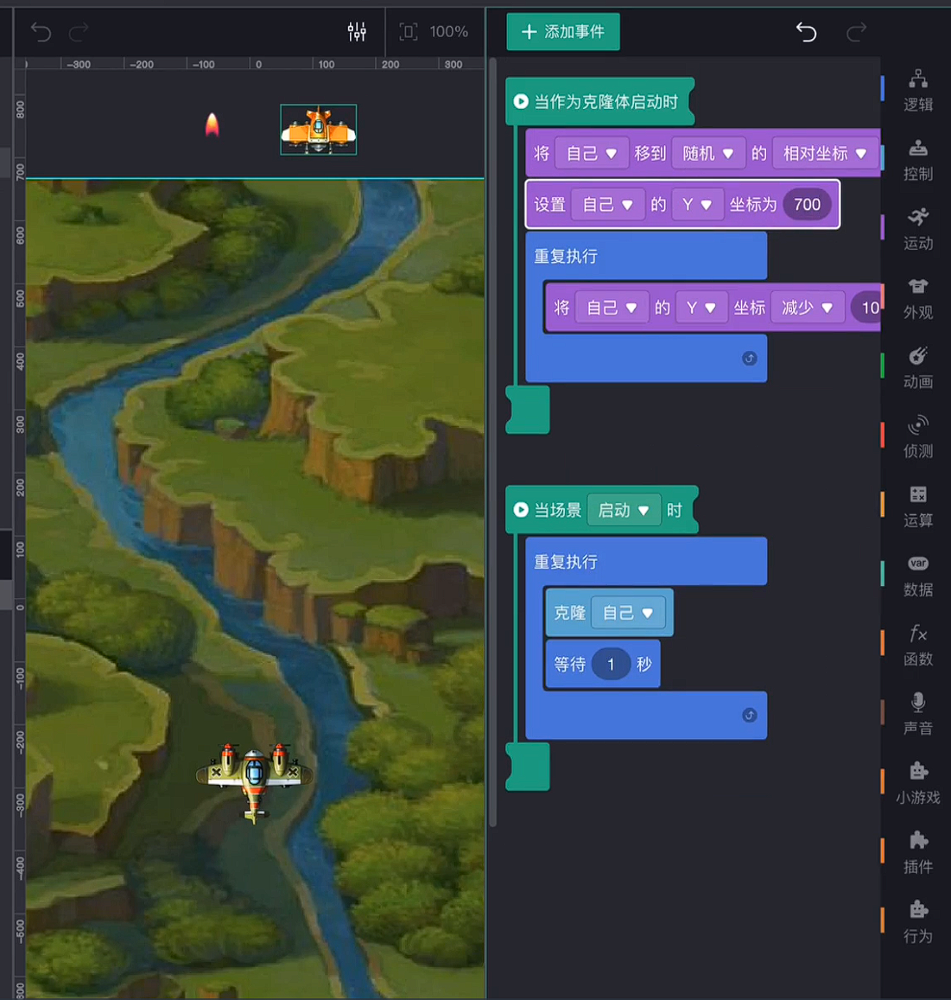

# lab01-让非专业人士制作游戏

## 1、实验/学习工具

微信小游戏制作工具：[https://gamemaker.weixin.qq.com/](https://gamemaker.weixin.qq.com/)

## 2、实验步骤

### 1、准备知识

微信小游戏制作工具提供了官方的开发文档——小游戏可视化制作工具手册 v2.1.3

阅读官方的开发文档可以帮助用户快速实现创意，创造价值

### 2、入门学习

“做中学”才是快速学习的基本途径。

观看新手指南《经典打飞机》后，学会了：

- 背景滚动

- 战机根据手指按下做出移动

- 发射子弹（克隆、相对坐标、坐标运算）

- 产生敌机（克隆、坐标运算）

- 对象碰撞

扫码体验

### 3、游戏创作与开发

#### 制作经典打飞机

##### 微信小游戏制作工具

无需安装，点击即用

[https://gamemaker.weixin.qq.com/](https://gamemaker.weixin.qq.com/)

##### 新建游戏

##### 滚动背景

至此，背景图片就可以循环滚动播放了

##### 移动飞机

手指按住飞机即可拖拽飞机移动

##### 发射子弹

##### 产生敌机

##### 碰撞消失

#### 添加血量机制

##### 素材导入与血量状态

##### 全局变量blood

由于我的游戏定义了三种血量状态：满血、半血、空血。因此我定义了一个全局变量blood，分别用2、1、0代表三种血量状态。

将满血状态的素材设置为：当场景启动时显示，这样在游戏开始时，便会显示满血，无需再判断。

##### 血量减少通知

为了改变全局变量的值，以及控制血量状态的显示，我新建了一个血量减少的通知。

收到血量减少通知时，如果当前状态为满血，则隐藏满血素材，显示半血素材，并使飞机闪烁2s，=延迟减少blood的值，因此在这2s中，飞机处于无敌状态；

如果当前状态为半血，则隐藏半血素材，显示空血素材，并使飞机脱离手指控制，闪烁飞机以表示游戏失败，同时暂停所有敌机以及发射子弹，2s后，显示“GAMEOVER”的字样。

##### 全局变量over

为了实现游戏结束时，暂停敌机以及发射子弹，我定义了一个全局变量over。over为0时，说明游戏正在进行；over为1时，说明游戏结束。

敌机和子弹同理。

##### 效果

