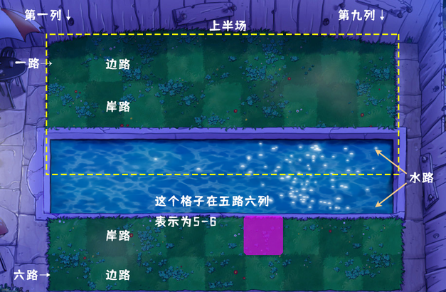
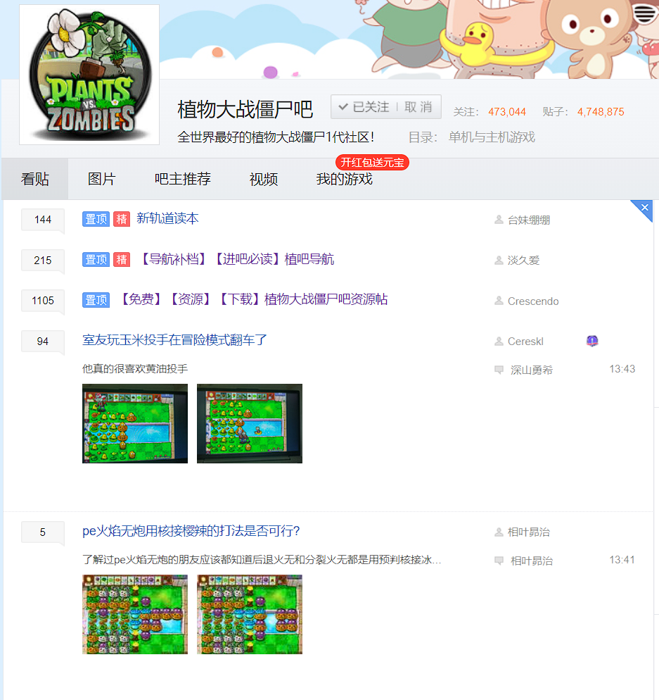
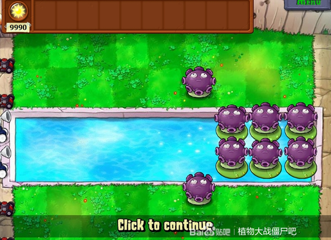
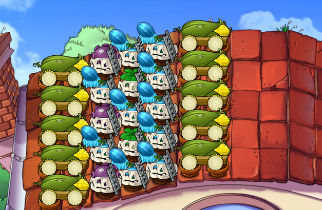
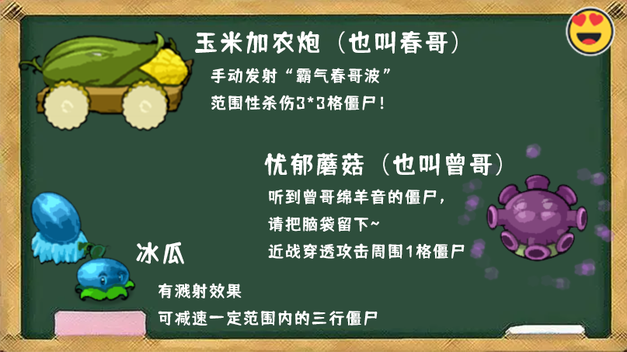
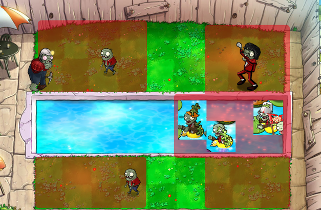

# lab02-小组策划

[思维导图](http://arron_vague.gitee.io/3-d-computer-game-programming-laboratory)

## 1、实验/学习工具

- 思维导图是头脑风暴、民主决策、会议记录、项目管理的重要工具。

- 名义小组技术是团队决策的重要方法，主要步骤包括：
  
  - 收集成员思路，形成若干方案
  
  - 投票
  
  - 组长总结

- 活动策划流程

## 2、实验步骤

1. 组成3个人的游戏研究小组

2. 确定题目，指定学习计划
   
   > 阅读 Tracy Fullerton, *GAME DESIGN WORKSHOP* 第2-4章（游戏结构、基本元素、戏剧元素）。选择一款你喜欢的中等规模游戏如“植物大战僵尸体”为案例，根据教材中一个或一组练习要求，回答该游戏的分析与设计问题。

3. 撰写博客

## 3、实验结果

- 思维导图

- 主要任务

### 案例分析——第2章 游戏的结构

> 阅读 Tracy Fullerton, *GAME DESIGN WORKSHOP* 第2-4章（游戏结构、基本元素、戏剧元素）。选择一款你喜欢的中等规模游戏如“植物大战僵尸”为案例，根据教材中一个或一组练习要求，回答该游戏的分析与设计问题。

##### 案例游戏

植物大战僵尸（简称pvz）

pvz的冒险模式已经是耳熟能详，这里就不过多赘述。本文接下来会用pvz的生存无尽模式作为案例进行分析。

##### 背景知识

上述坐标知识会是重点，记笔记。

[论文引用](https://forum.crescb.com/se-general/%e6%89%8b%e6%92%95%e8%bd%a8%e9%81%93%e8%af%bb%e6%9c%ac/#post-1219)

#### 练习2.1：想一个游戏

> 1. 想想你玩过的任何一款游戏，然后把游戏的描述写下来。写详细一些，你要假设是给从来没有玩过这种类型的游戏的人写的。

在植物大战僵尸的生存无尽模式中，玩家将面对无尽的僵尸攻击，直到僵尸摧毁了玩家的防线。

玩家需要通过种植不同种类的**植物**

来阻止僵尸入侵**花园**。

每个植物都有不同的特殊能力和攻击方式，玩家需要在每个回合开始前选择合适的植物来对抗不同类型的**僵尸**。（图片里缺的是雪人僵尸，纯送钱，无特殊能力）

游戏开始后，僵尸将从屏幕右侧向玩家的花园进发。玩家需要在花园中种植植物，并利用它们的攻击能力来消灭僵尸。玩家可以通过**阳光**来种植植物，阳光会从天空中掉落或由特定的植物产生。每个植物的价格不同，玩家需要合理利用有限的阳光资源来种植最有效的植物。

在游戏过程中，玩家需要时刻注意僵尸的进攻。僵尸会分为**不同的类型**，有的移动速度快，有的有特殊能力，有的能抵挡攻击等等。玩家需要根据僵尸的特点来选择合适的植物来对抗它们。如果僵尸成功抵达花园，它们将开始啃食玩家的植物，直到摧毁玩家的防线。

随着游戏的进行，僵尸的数量和难度将逐渐增加。玩家需要在有限的资源和时间内**合理规划和管理植物**（传统八炮），以抵御更强大的僵尸进攻。

生存无尽模式中的目标是尽可能地坚持下去，抵御越来越强大的僵尸进攻，直到玩家无法继续生存为止。

#### 练习2.2

> 描述玩家会怎样开始玩《植物大战僵尸》。在每种情况下他们需要怎么做——社交、进程或技巧？

pvz是一款单人游戏，玩家需要一人面对这个游戏系统。玩家都是自愿参与和使用这个娱乐环境的。

##### 社交

pvz是一款担任游戏，玩家需要一人面对这个游戏系统。但是，通过参加与pvz相关的论坛、社交媒体群组或在线社区（[植物大战僵尸吧](https://tieba.baidu.com/f?kw=%E6%A4%8D%E7%89%A9%E5%A4%A7%E6%88%98%E5%83%B5%E5%B0%B8&ie=utf-8&tab=main)），与其他玩家分享经验、策略和建议。

##### 进程

pvz生存无尽模式周而复始，永无止尽。

在选卡界面选好植物，进入战斗，击退僵尸后再次进入选卡界面的过程——称作**一次选卡**。

一次选卡包含20波僵尸（**w1**~**w20**，w来自waves），w10和w20每波都会有一个旗帜僵尸（**f**，f来自flags）带领一大波僵尸来袭。

##### 技巧

1. 规划植物阵型
   
   第一个阵型：传统八炮
   
   

2. 花费阳光明智：在游戏中，阳光是一种资源，用于种植和升级植物。确保您合理地利用阳光，将其用于最需要的植物，以及在适当的时机进行升级。由于八炮火力充足，只需要携带南瓜（+模仿者南瓜），缝缝补补。（如下图）
   
   

3. 研究敌人：不同类型的僵尸具有不同的弱点和攻击方式。通过观察和了解僵尸的特点，您可以选择合适的植物来对抗它们，并制定更有效的策略。有小丑关（如下图）推荐携带曾哥套件（大喷、曾哥、咖啡豆三件套，当然这里还有荷叶），因为小丑有小概率自爆，炸毁曾哥。（如上图）
   
   

4. 不断尝试和调整：《植物大战僵尸》是一个具有挑战性的游戏，您可能需要多次尝试和调整策略才能成功。保持耐心，并根据您在游戏中的经验进行调整和改进。
   
   总结经验后得出：炮的推荐落点和大致打击范围如下：
   
   
   
   一门炮的恢复时间（“CD”）约为**36秒**；一共8门炮，一次发射2门，总共**发射4次**。
   
   因此，我们应当**每9秒左右发射一对炮**，可以稍慢，但不应该更快。

#### 练习2.3

> 用一句话描述《植物大战僵尸》的目标

pvz生存模式，玩家的目标是尽可能地抵御僵尸的进攻，生存更长的时间，并在每次进攻之间进行合理的准备和调整，创造最高的生存时间记录。

1437大帝以冲关为目标。

#### 练习2.4：规则

> 你可以想出一个没有规则的游戏吗？如果有，描述这个游戏。只有一个规则的游戏会怎么样呢？为什么这个练习很难？

我无法想象出一个完全没有规则的游戏，就算是被游戏玩家调侃为**地球Online**的人生，也似乎从出生以来，就被赋予了各种条条框框。

如果《植物大战僵尸》只有一个规则：玩家在游戏中只能使用一种特定的植物来抵抗僵尸。那将大大改变游戏的玩法和体验。

1. 策略单一：由于只能使用一种植物，玩家的策略选择将被限制在单一的选项上。这将导致游戏变得相对较简单，因为玩家可以专注于提升这种植物的能力和战略运用，而不必考虑其他植物的组合和互动。

2. 重复性增加：由于单一的规则，游戏中的玩法可能会变得相对单调。玩家将不再体验到通过选择不同植物和策略来对抗僵尸的多样性和挑战。

3. 可预测性增加：在游戏中只有一种植物，玩家将更容易预测和适应僵尸的行为模式。这可能导致游戏变得更加线性，减少了探索和惊喜的元素。

4. 缺乏变化和战略深度：《植物大战僵尸》的魅力之一在于玩家可以根据不同的僵尸类型和关卡来选择植物，并制定相应的战略。但是，如果只有一种植物可用，游戏将失去这种变化和战略深度，可能导致玩家的兴趣在一定时间后减弱。

#### 练习2.5：冲突

> 描述《植物大战僵尸》如何给玩家制造冲突。

1. 僵尸种类多样化
   
   
   
   - 必杀系 —— **对植物的伤害是一击必杀的僵尸**。
     
     代表僵尸：红眼（白眼）、冰车、小丑。
     
     必杀系僵尸整体强度极高，尤其是红眼，是最令人头痛的存在之一。
   
   - 闪现系 —— **从非常规位置发起攻势的僵尸**。
     
     代表僵尸：矿工、小鬼、伴舞、蹦极。
     
     这类僵尸自带“穿越”属性，不走寻常路，新玩家可能会被打个措手不及。
   
   - 飞跃系 —— **具有跳跃或飞行功能的僵尸**。
     
     代表僵尸：撑杆、海豚、跳跳、气球。
     
     这类僵尸具备某种意义上绕开植物的能力，需要有对应策略防止“偷家”。
   
   - 啃食系 —— 以**啃食作为主要伤害植物手段的僵尸**。
     
     代表僵尸：梯子、橄榄。
     
     最普通也最常见的僵尸类别，其中梯子速度最快，橄榄速度快且血量厚，值得注意。此外还有普僵路障铁桶门板报纸等各种杂鱼，都属于啃食系。

2. 地形限制
   
   泳池想要种植植物必须在水面上放置荷叶。
   
   
   
   屋顶想要种植植物必须在瓦片上放置花盆。
   
   

3. 植物种类和能力
   
   

4. 游戏进程逐渐增加难度
   
   根据僵尸潮的猛烈程度，我们将整个无尽分为两大阶段：
   
   - 阶段一：开局阶段。僵尸攻势逐渐变猛。大约为前100f。
   
   - 阶段二：冲关阶段。游戏难度趋于平稳，达到饱和。大约从100f后起。

#### 练习2.6：挑战

> 为什么《植物大战僵尸》特别有挑战力

生存无尽模式里，无炮阵容（机械钟）

通常比有炮阵容（传统八炮）

**难得多**。

因此，回答此问题时仅以传统八炮为例。

设想一下，如果我们是一个初入pvz无尽模式的新手玩家。在发现春哥无法戴上南瓜保护套后，经历了被**矿工、舞王**威胁、被**小鬼**天降正义、被**珊瑚三人组骚扰**后，终于发现了春哥的安全放置区域（红色区域为“危险区域”）。

剔去危险区域后，安全区域总共够放置八门炮。

只有八门炮，肯定无法抵御僵尸的进攻，因此，我们需要在前后场种植其它植物。

- 后排**曾哥** —— 不用多说，为了快速杀死**矿工、小鬼**僵尸，第二列的四个曾哥起到了极大的作用。

- 前排**曾哥、地刺王** —— 早期pvz无尽模式尚未研究透彻，认为植物越多越好，实际上略显冗余。

- 后排的**冰瓜** —— 为了减速红眼，以及迅速杀死从7列钻出来的伴舞，以免啃炮。同时可以注意到，一路和六路各有三个冰瓜，而二路和四路只有一个冰瓜，是因为，水路顶满的六个曾哥输出极高，因此输出压力主要落在一路和六路。

- **伞叶** —— 防蹦极和投篮车。

- 四朵**双子向日葵** —— 阳光来源

经典八炮。知名度最高的无尽阵型，是对传统八炮的优化。也是新手体验的最佳阵型。更是整个PVZ1无尽模式阵图的代表。

详情请看[【Kaleidoscope of Endless Build Culture】九章阵华录](https://tieba.baidu.com/p/5272254427)。

#### 练习2.7：前设

> 《植物大战僵尸》的游戏前设是什么？

在一个平静的的郊外花园，突然出现了一群饥饿的僵尸。这些僵尸被一位名叫“僵尸博士”的邪恶科学家控制着，他的目标是占领整个城镇并吃掉所有的人脑。

为了抵抗僵尸的入侵，你决定利用自己种植的植物来对抗僵尸。通过种植不同的植物，你可以发挥它们的特殊能力，如射击、炸弹、冰冻等，以阻止僵尸的进攻并保护花园。

你需要在每个关卡中种植植物、管理资源和指定战略，以击败不断增强的僵尸不对。随着游戏的进行，玩家将逐渐解锁更多的植物和关卡，面对更强大的僵尸挑战。

#### 练习2.8：故事

> 《植物大战僵尸》的故事是否曾把你紧紧抓住，让你产生触动了，或激发了你的灵感呢？
