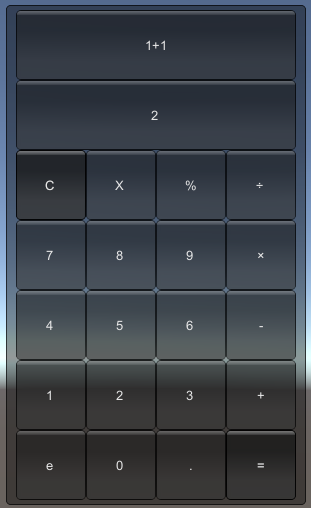

# lab03-游戏循环和mvc结构

## 1、实验/学习工具

- 自学 [即时模式 GUI (IMGUI)](https://docs.unity.cn/cn/current/Manual/GUIScriptingGuide.html) 绘制游戏人机交互界面，仅需要 IMGUI 基础知识和 控件 两个部分内容。

- 学习MVC概念。[MVC 模式](https://www.runoob.com/design-pattern/mvc-pattern.html)

## 2、实验内容

1. 完成课件上操作2-01到2-08的内容；

2. 通过井字棋小游戏，理解MVC元素之间的协作关系

## 3、实验结果

- 模仿井字棋代码，编写一个小游戏或应用

- 作业博客

### 简单计算器

#### 视频链接

[点击观看演示视频](https://www.bilibili.com/video/BV1Ah4y1Y7Qb/?vd_source=212ff176b778171e26249f81cfb5bdbc)

基于曾经在leetcode刷到的一道题：[基本计算器II](https://leetcode.cn/problems/basic-calculator-ii/description/)，实现了一个基本计算器。

输入需满足：

- 输入s为一个**有效表达式**

- s由整数和算符 **+，-，×，÷** 组成

- 表达式中的所有整数都是非负整数，且在范围[0, 2 ^ 31 - 1]内

**示例1：**

> s = "3+2×2"

**示例2：**

> s = "3÷2"

**示例3：**

> s = "3+5÷2"

整数除法仅保留整数部分。

#### 基础面板



#### View

```cs
    void OnGUI()
    {
        GUI.Box(new Rect(245, 5, 300, 500), "");
        GUI.Button(new Rect(255, 10, 280, 70), expression);
        GUI.Button(new Rect(255, 80, 280, 70), result);
        for (int i = 0; i < keyboard.GetLength(0); ++i)
        {
            for (int j = 0; j < keyboard.GetLength(1); ++j)
            {
                char cur_c = keyboard[i, j]; 
                if (cur_c == 'C' && GUI.Button(new Rect(255 + j * 70, 50 + i * 70 + 100, 70, 70), cur_c.ToString()))
                {
                    Clear();
                }
                else if (cur_c == '=' && GUI.Button(new Rect(255 + j * 70, 50 + i * 70 + 100, 70, 70), cur_c.ToString()))
                {
                    Calculate();
                }
                else if (GUI.Button(new Rect(255 + j * 70, 50 + i * 70 + 100, 70, 70), cur_c.ToString()))
                {
                    Input(cur_c);
                    Debug.Log(cur_c);
                }
            }
        }
    }
```

#### Model

```cs
    // Entities and their states / Model
    // 模型只能包含游戏对象数据
    private string expression;
    private char[,] keyboard = { { 'C', 'X', '%', '÷' }, { '7', '8', '9', '×' }, { '4', '5', '6', '-' }, { '1', '2', '3', '+' }, { 'e', '0', '.', '=' } };
    private Stack<int> num = new Stack<int>();
    private char preSign;
    private int init_num;
    private string result;
```

#### Controller

```cs
    // Components
    // here! any ui can not be referenced
    // 模型对象（数据）的基本操作逻辑
    void Init()
    {
        Clear();
    }

    // 输入表达式
    void Input(char cur_c)
    {
        expression += cur_c;   
    }

    // 通过表达式计算结果
    void Calculate()
    {
        int n = expression.Length;
        for (int i = 0; i < n; ++i) {
            char c = expression[i];
            if (char.IsDigit(c))
            {
                init_num = init_num * 10 + c - '0';
            }
            if (!char.IsDigit(c) || i == n - 1)
            {
                switch (preSign)
                {
                    case '+':
                        num.Push(init_num);
                        break;
                    case '-':
                        num.Push(-init_num);
                        break;
                    case '*':
                        num.Push(num.Pop() * init_num);
                        break;
                    default:
                        num.Push(num.Pop() / init_num);
                        break;
                }
                preSign = c;
                init_num = 0;
            }
        }
        int res = 0;
        while (num.Count > 0)
        {
            res += num.Pop();
        }
        result = res.ToString();
    }

    // 重置变量和数据结构
    void Clear()
    {
        num.Clear();
        expression = "";
        result = "";
        init_num = 0;
        preSign = '+';
    }
```

#### 完整代码

```cs
using System.Collections;
using System.Collections.Generic;
using UnityEngine;

public class Calculator : MonoBehaviour
{
    // Entities and their states / Model
    private string expression;
    private char[,] keyboard = { { 'C', 'X', '%', '÷' }, { '7', '8', '9', '×' }, { '4', '5', '6', '-' }, { '1', '2', '3', '+' }, { 'e', '0', '.', '=' } };
    private Stack<int> num = new Stack<int>();
    private char preSign;
    private int init_num;
    private string result;

    // System Handlers
    void Start()
    {
        Init();
    }

    // View render entities / models
    // Here! you cannot modify model directly, use components/controls to do it
    void OnGUI()
    {
        GUI.Box(new Rect(245, 5, 300, 500), "");
        GUI.Button(new Rect(255, 10, 280, 70), expression);
        GUI.Button(new Rect(255, 80, 280, 70), result);
        for (int i = 0; i < keyboard.GetLength(0); ++i)
        {
            for (int j = 0; j < keyboard.GetLength(1); ++j)
            {
                char cur_c = keyboard[i, j]; 
                if (cur_c == 'C' && GUI.Button(new Rect(255 + j * 70, 50 + i * 70 + 100, 70, 70), cur_c.ToString()))
                {
                    Clear();
                }
                else if (cur_c == '=' && GUI.Button(new Rect(255 + j * 70, 50 + i * 70 + 100, 70, 70), cur_c.ToString()))
                {
                    Calculate();
                }
                else if (GUI.Button(new Rect(255 + j * 70, 50 + i * 70 + 100, 70, 70), cur_c.ToString()))
                {
                    Input(cur_c);
                    Debug.Log(cur_c);
                }
            }
        }
    }

    // Components
    // here! any ui can not be referenced
    void Init()
    {
        Clear();
    }

    // 输入表达式
    void Input(char cur_c)
    {
        expression += cur_c;   
    }

    // 通过表达式计算结果
    void Calculate()
    {
        int n = expression.Length;
        for (int i = 0; i < n; ++i) {
            char c = expression[i];
            if (char.IsDigit(c))
            {
                init_num = init_num * 10 + c - '0';
            }
            if (!char.IsDigit(c) || i == n - 1)
            {
                switch (preSign)
                {
                    case '+':
                        num.Push(init_num);
                        break;
                    case '-':
                        num.Push(-init_num);
                        break;
                    case '*':
                        num.Push(num.Pop() * init_num);
                        break;
                    default:
                        num.Push(num.Pop() / init_num);
                        break;
                }
                preSign = c;
                init_num = 0;
            }
        }
        int res = 0;
        while (num.Count > 0)
        {
            res += num.Pop();
        }
        result = res.ToString();
    }

    // 重置变量和数据结构
    void Clear()
    {
        num.Clear();
        expression = "";
        result = "";
        init_num = 0;
        preSign = '+';
    }
}

```