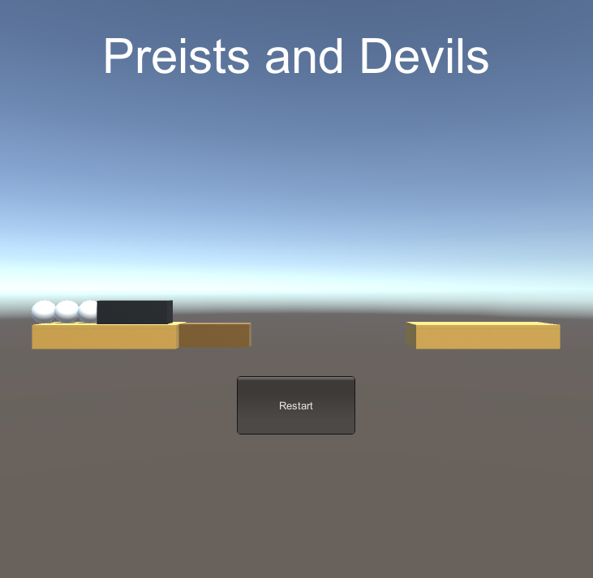
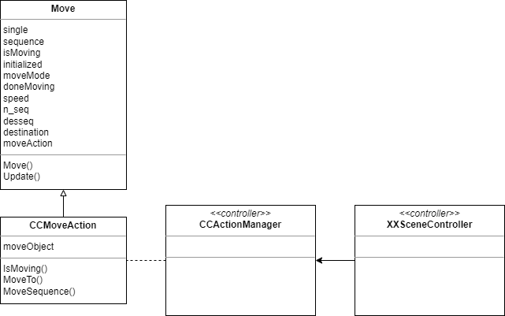

# lab06-创建游戏世界2

以下内容与原版无异，详情可查看[牧师与魔鬼 原版](../../lab05/Priests%20and%20Devils/README.md)

- 游戏中提及的事物

- 玩家动作表

- 预制

## 牧师与魔鬼 动作分离版

> 设计一个裁判类，当游戏达到结束条件时，通知场景控制器游戏结束

### 游戏展示



点击观看视频👇

[牧师与魔鬼 动作分离版](https://www.bilibili.com/video/BV1aN4y1k791/?vd_source=212ff176b778171e26249f81cfb5bdbc)

### 添加裁判类

原本由`FirstController`检查游戏状态的函数继承到裁判类`JudgeController.UpdateGameState()`中。

```cs
public class JudgeController
{
    ...

    //判断游戏状态
    public int UpdateGameState()
    {
        if (firstCtrl.gameState != FirstController.PLAYING)
        {
            return firstCtrl.gameState;
        }
        //判断是否失败
        int[,] rolePos = new int[2, 3] { { 0, 0, 0 }, { 0, 0, 0 } };
        foreach (RoleController r in firstCtrl.RoleCtrl)
        {
            rolePos[r.roleType, r.roleState]++;
        }
        if ((rolePos[0, 0] > 0 && rolePos[0, 0] < rolePos[1, 0]) ||
           (rolePos[0, 1] > 0 && rolePos[0, 1] < rolePos[1, 1]) ||
           (rolePos[0, 2] > 0 && rolePos[0, 2] < rolePos[1, 2]))
        {
            return FirstController.FAILED;
        }
        //判断是否成功
        foreach (RoleController r in firstCtrl.RoleCtrl)
        {
            if (r.roleType == 0 && r.roleState != FirstController.RIGHTLAND)
            {
                return FirstController.PLAYING;
            }
        }
        return FirstController.WIN;
    }
}
```

通过变量`gameState`通知场景控制器是否结束游戏。

### 集成动作管理类

`Models.Move`迁移到`Action.Move`，不再需要`Controllers.MoveController`。

添加移动序列`desseq`，解决了lab05中游戏对象穿模的问题。

```cs
public class Move : MonoBehaviour
{
    ...

    void Update()
    {
        if (moveMode == -1)
        {
            return;
        } 
        if (!initialized)
        {
            /*如果moveMode为single，则desseq数组长度为1，将目标位置destination赋值给desseq[0]；如果moveMode为sequence，则desseq数组长度为3，分别将当前位置(transform.localPosition)和目标位置(destination)在Y轴上升高1个单位后赋值给desseq[0]和desseq[1]，并将目标位置destination赋值给desseq[2]。*/
            if (moveMode == single)
            {
                desseq = new Vector3[1];
                desseq[0] = destination;
            }
            else if (moveMode == sequence)
            {
                desseq = new Vector3[3];
                desseq[0] = transform.localPosition + new Vector3(0, 1, 0);
                desseq[1] = destination + new Vector3(0, 1, 0);
                desseq[2] = destination;
            }
            else
            {
                Debug.Log("ERROR");
            }
            initialized = true;
        }
        isMoving = true;
        /*如果n_seq大于等于desseq数组的长度，表示已经完成了所有的移动序列，将一些变量重置为默认值，并将isMoving设置为false，然后返回。*/
        if (n_seq >= desseq.Length)
        {
            n_seq = 0;
            moveMode = -1;
            initialized = false;
            isMoving = false;
            return;
        }
        /*如果当前位置(transform.localPosition)与desseq[n_seq]相等，则表示已经到达当前目标位置，将n_seq加1，表示切换到下一个目标位置。*/
        if (transform.localPosition == desseq[n_seq])
        {
            n_seq++;
            return;
        }
        transform.localPosition = Vector3.MoveTowards(transform.localPosition, desseq[n_seq], speed * Time.deltaTime);
    }
}
```

`Action.CCMoveAction`中的`MoveTo()`和`MoveSequence()`分别封装了对象的单次移动和序列移动。

```cs
public class CCMoveAction
{
    ...

    public void MoveTo(GameObject moveObject, Vector3 destination)
    {
        Move test;
        this.moveObject = moveObject;
        if (!moveObject.TryGetComponent<Move>(out test))
        {
            moveObject.AddComponent<Move>();
        }
        this.moveObject.GetComponent<Move>().moveAction = this;
        this.moveObject.GetComponent<Move>().destination = destination;
        this.moveObject.GetComponent<Move>().moveMode = Move.single;
    }

    public void MoveSequence(GameObject moveObject, Vector3 destination)
    {
        Move test;
        this.moveObject = moveObject;
        if (!moveObject.TryGetComponent<Move>(out test))
        {
            moveObject.AddComponent<Move>();
        }
        this.moveObject.GetComponent<Move>().moveAction = this;
        this.moveObject.GetComponent<Move>().destination = destination;
        this.moveObject.GetComponent<Move>().moveMode = Move.sequence;
    }
}
```

`FirstController.MoveRole`和`FirstController.MoveBoat`的具体实现迁移到`CCActionManager`。

```cs
public class CCActionManager
{
    ...

    //点击角色时执行
    public void MoveRole(BoatController BoatCtrl, RoleController RoleCtrl, int destination, int seat)
    {
        Vector3 finalPos;
        if (destination == FirstController.RIGHTLAND)
        {
            finalPos = Position.roleRightPos[seat];
        }
        else if (destination == FirstController.LEFTLAND)
        {
            finalPos = Position.roleLeftPos[seat];
        }
        else
        {
            if (BoatCtrl.onLeftside)
            {
                finalPos = Position.seatLeftPos[seat];
            }
            else
            {
                finalPos = Position.seatRightPos[seat];
            }
        }
        moveRoleAction.MoveSequence(RoleCtrl.GetModelGameObject(), finalPos);
    }

    //点击船时执行
    public void MoveBoat(BoatController BoatCtrl, int destination)
    {
        if (destination == FirstController.RIGHTLAND)
        {
            moveBoatAction.MoveTo(BoatCtrl.GetModelGameObject(), Position.boatRightPos);
            for (int i = 0; i < BoatCtrl.seat.Length; i++)
            {
                if (BoatCtrl.seat[i] != -1)
                {
                    RoleController r = controller.RoleCtrl[controller.IDToNumber(BoatCtrl.seat[i])];
                    moveRoleAction.MoveTo(r.GetModelGameObject(), Position.seatRightPos[i]);
                }
            }
        }
        else
        {
            moveBoatAction.MoveTo(BoatCtrl.GetModelGameObject(), Position.boatLeftPos);
            for (int i = 0; i < BoatCtrl.seat.Length; i++)
            {
                if (BoatCtrl.seat[i] != -1)
                {
                    RoleController r = controller.RoleCtrl[controller.IDToNumber(BoatCtrl.seat[i])];
                    moveRoleAction.MoveTo(r.GetModelGameObject(), Position.seatLeftPos[i]);
                }
            }
        }
    }
}
```

`FirstController.MoveRole`和`FirstController.MoveBoat`直接调用到`CCActionManager.MoveRole`和到`CCActionManager.MoveBoat`。

```cs
public class FirstController : MonoBehaviour, ISceneController, IUserAction
{
    ...

    // 点击船时执行
    public void MoveBoat()
    {
        ...

        if (BoatCtrl.onLeftside)
        {
            actionManager.MoveBoat(BoatCtrl, RIGHTLAND);
        }
        else
        {
            actionManager.MoveBoat(BoatCtrl, LEFTLAND);
        }
        BoatCtrl.onLeftside = !BoatCtrl.onLeftside;
    }

    // 点击角色时执行
    public void MoveRole(int id)
    {
        ...

        switch (RoleCtrl[num].roleState)
        {
            case 0: // LEFTLAND
                if (!BoatCtrl.onLeftside) return;
                seat = BoatCtrl.embark(id);
                if (seat == -1) return;
                LandCtrl[0].LeaveLand(id);
                RoleCtrl[num].GoTo(BOAT);
                actionManager.MoveRole(BoatCtrl, RoleCtrl[num], BOAT, seat);
                break;

            ...

            default: break;
        }
    }

    ...
}
```

`FirstController.MoveController`替换成`FirstController.CCActionManager`，由动作管理类负责管理动作。

### 项目结构

MVC模式

```powershell
├─Action
│      CCActionManager.cs
│      CCMoveAction.cs
│      Move.cs
│      
├─Controllers
│      BoatController.cs
│      FirstController.cs
│      IObjectController.cs
│      ISceneController.cs
│      IUserAction.cs
│      JudgeController.cs
│      LandController.cs
│      RoleController.cs
│      SSDirector.cs
│      
├─Models
│      Boat.cs
│      Click.cs
│      Land.cs
│      Position.cs
│      Role.cs
│      
└─Views
        UserGUI.cs 
```

## UML图



## 文章引用

[Unity3D小游戏——牧师与魔鬼（动作分离版） - LoongChan - 博客园](https://www.cnblogs.com/LC32/p/15424201.html)
