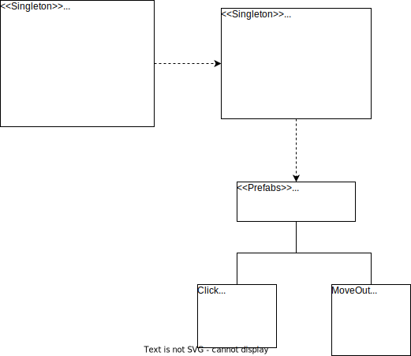

# lab08-物理引擎与碰撞1


**案例研究：“鼠标打飞碟”游戏设计**

游戏需求：

- 分多个 round ， 每个 round 都是 n 个 trial；
- 每个 trial 的飞碟的色彩、大小、发射位置、速度、角度、每次发射飞碟数量不一；
- 鼠标击中得分，得分按色彩、大小、速度不同计算，计分规则自由定。

鼠标打飞碟（Hit UFO）

使用对象池管理飞碟对象

对象池技术

用一个或多个集合存储某类有限的对象实例。它在承担对象创建和回收的职责过程中，

- 按一定策略缓存一定数量的对象。
- 在客户请求创建对象时，优先使用已有的对象，并恰当初始化。如果没有缓存对象，再创建对象。
- 在对象使用完后，并不立即回收，而是先放回缓冲池，如果有请求则立即转为使用，已减少创建成本。在系统空闲时，按一定策略回收。

UML



SceneController中会实例化UFOFactory，并交给UFOFactory初始化UFO池。本次实验没有使用used和free两个list存储UFO对象，直接开辟一个固定长度的UFO数组。

```csharp
public class SceneController : MonoBehaviour
{
	...
    GameObject factory;

    public void Awake(){
        ...
        factory = new GameObject("UFO factory");
        factory.AddComponent<UFOFactory>();
        factory.GetComponent<UFOFactory>().SetDepend(this);
    }
	...
}
```

```csharp
public class UFOFactory : MonoBehaviour
{
	...
    public UFO[] UFOs;
    ...
    // 设定飞碟工厂的上游场景控制器
    public void SetDepend(SceneController firstCtrl)
    {
        this.myController = firstCtrl;
        trial = myController.CharDataModel.Attributes.UFOs_per_round;
        UFOs = new UFO[trial];
    }

    public void InitializeUFO()
    {
		...
        for (int i = 0; i < trial; i++)
        {
            if (UFOs[i] != null)
            {
                Destroy(UFOs[i].ufoObject);
            }
            UFOs[i] = new UFO(this, i);
            UFOs[i].SetUFOActive(false);
        }
    }
    
    ...

    public void FailUFO(int id)
    {
        UFOs[id].SetUFOActive(false);
		...
    }
}
```

每一轮游戏开始前必做：

- 更新游戏难度

- 初始化UFO池

UFO实例化时会挂载Click.cs以及MoveOut.cs

Click.cs用来控制UFO被点击时触发的效果，MoveOut.cs用来控制UFO飞出窗口的触发效果

使用ScriptableObject配置不同的飞碟

```csharp
using System;
using UnityEngine;

[System.Serializable]
public class Attributes
{
    [Tooltip("blood")]
    public int blood;
    [Tooltip("difficulty")]
    public int initial_difficulty;
    [Tooltip("number of UFOs per round")]
    public int UFOs_per_round;
}

[CreateAssetMenu(fileName = "CharacterItem", menuName = "(ScriptableObject)CharacterItem")]
public class CharacterItem : ScriptableObject
{
    public string Name;
    public string Desc;
    [Tooltip("game settings")]
    public Attributes Attributes;

    public static CharacterItem CreateCharacterItem()
    {
        CharacterItem item = ScriptableObject.CreateInstance<CharacterItem>();
        item.Attributes = new Attributes();
        return item;
    }
}
```

在Inspector中可以设置游戏的初始难度（1~5）、血量以及每轮出现的UFO数。

使用物理引擎管理飞碟飞行路径

若UFO对象没有Rigidbody组件，则添加，并施加冲量力，影响UFO的飞行路径。

```csharp
public class UFO
{
	...
    public GameObject ufoObject;
	
	...
	// 设置UFO的飞行参数，包括颜色、缩放大小、位置和力的方向
    public void Fly(Color c, float scale, Vector3 pos, Vector3 force)
    {
		...
        ufoObject.transform.position = pos;
        if (!ufoObject.GetComponent<Rigidbody>())
        {
            ufoObject.AddComponent<Rigidbody>();
        }
        // 对UFO施加冲量力
        ufoObject.GetComponent<Rigidbody>().AddForce(force, ForceMode.Impulse);
    }

	...
}
```

参考文献

[Unity3D小游戏——打飞碟](https://www.cnblogs.com/LC32/p/15469806.html)

