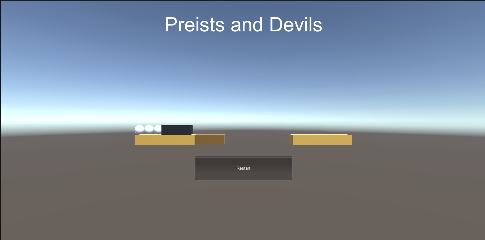
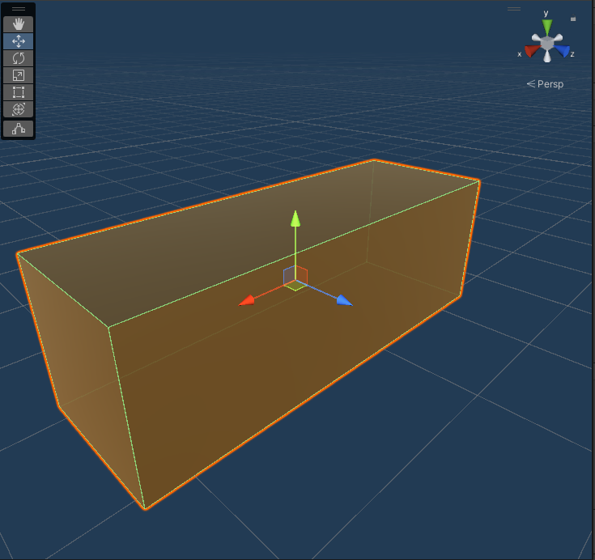
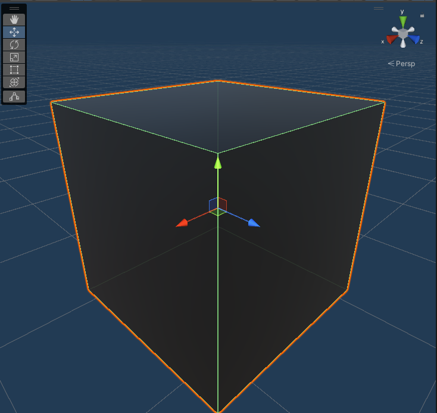
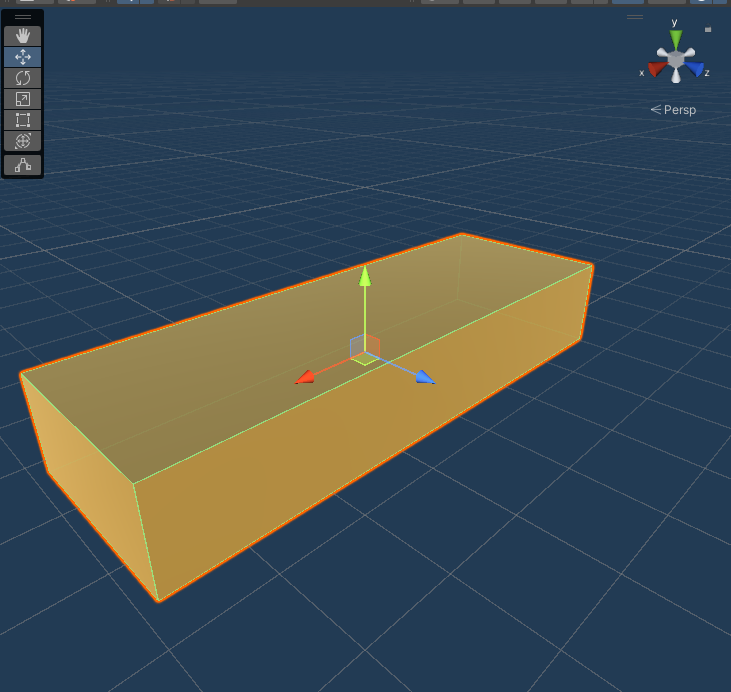
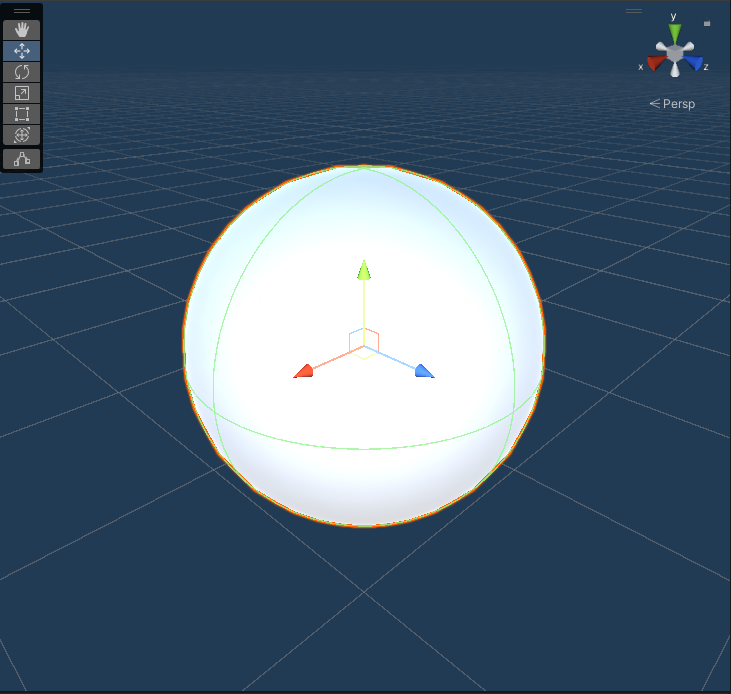
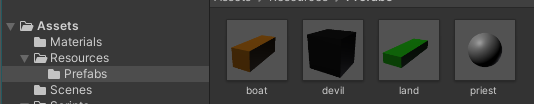
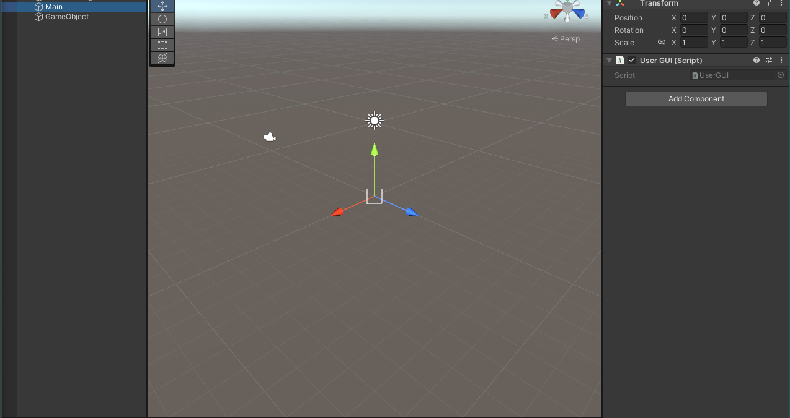
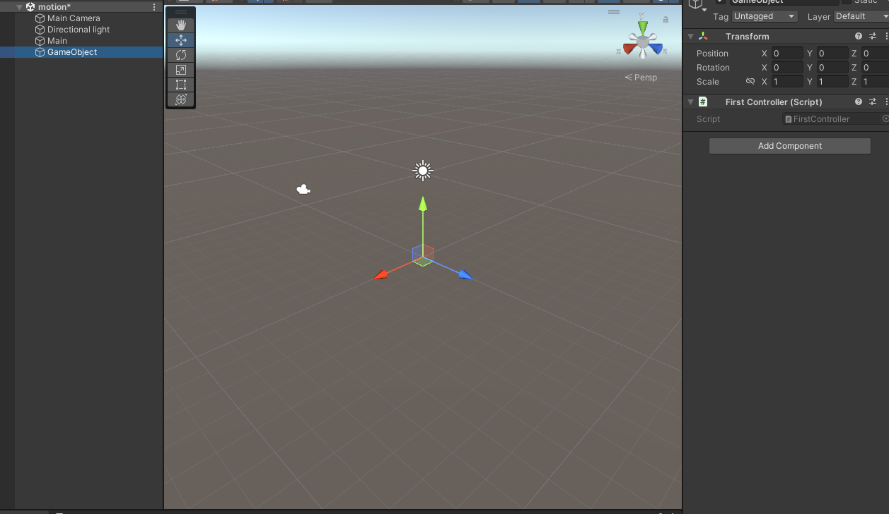
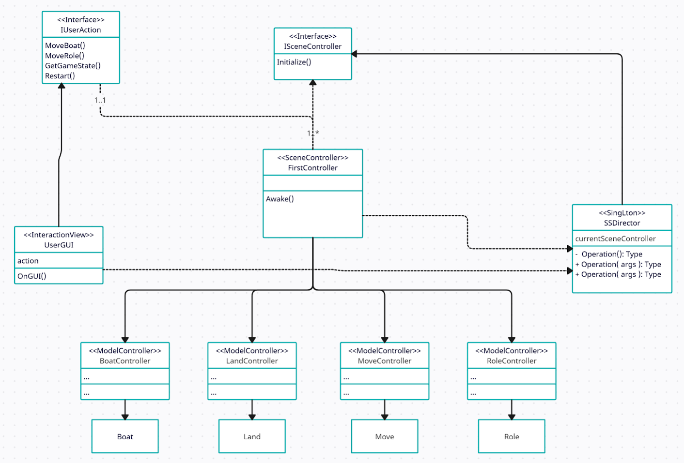

# lab05-创建游戏世界1

## 牧师与魔鬼

> Priests and Devils
> 
> Priests and Devils is a puzzle game in which you will help the Priests and Devils to cross the river within the time limit. There are 3 priests and 3 devils at one side of the river. They all want to get to the other side of this river, but there is only one boat and this boat can only carry two persons each time. And there must be one person steering the boat from one side to the other side. In the flash game, you can click on them to move them and click the go button to move the boat to the other direction. If the priests are out numbered by the devils on either side of the river, they get killed and the game is over. You can try it in many > ways. Keep all priests alive! Good luck!

### 游戏展示



### 视频演示

[牧师与魔鬼 说了再见版](https://www.bilibili.com/video/BV19N4y1y7bi/)

### 游戏中提及的事物

#### boat（船）



#### devil（魔鬼）



#### land（陆地）



#### priest（牧师）



### 玩家动作表

| 鼠标点击    | 响应   |
|:-------:|:----:|
| 陆上牧师    | 牧师登船 |
| 陆上魔鬼    | 魔鬼登船 |
| 船上牧师    | 牧师登陆 |
| 船上魔鬼    | 魔鬼登陆 |
| 船       | 开船   |
| Restart | 重开   |

### 预制



### 在场景控制器Initialize方法中加载游戏对象

```cs
    public void Initialize() {
        //如果有，则释放原有的GameObject
        for (int i = 0; i < 6; i++) {
            if (RoleCtrl[i] != null) {
                Destroy(RoleCtrl[i].GetModelGameObject());
            }
        }
        for (int i = 0; i < 2; i++) {
            if (LandCtrl[i] != null) {
                Destroy(LandCtrl[i].GetModelGameObject());
            }
        }
        if (BoatCtrl != null) {
            Destroy(BoatCtrl.GetModelGameObject());
        }
        // 加载控制器和模型
        BoatCtrl = new BoatController();
        BoatCtrl.CreateModel();

        for (int i = 0; i < 6; i++) {
            int roleType = (i < 3) ? PRIEST : DEVIL;
            RoleCtrl[i] = new RoleController(roleType, rolesID[i]);
            RoleCtrl[i].CreateModel();
        }
        LandCtrl[0] = new LandController(LEFTLAND, rolesID);
        LandCtrl[1] = new LandController(RIGHTLAND, rolesID);
        LandCtrl[0].CreateModel();
        LandCtrl[1].CreateModel();
        MoveCtrl = new MoveController();
        //开始游戏
        gameState = PLAYING;
    }
```

`BoatController.CreateModel`、`RoleController.CreateModel`和`LandController.CreateModel`都实现了动态加载游戏对象

以`BoatController`为例，`BoatController.CreateModel`中初始化了`Boat`。

```cs
    public void CreateModel(){
        boatModel = new Boat(Position.boatLeftPos);
        boatModel.boat.GetComponent<Click>().setClickAction(this);
    }
```

而`Boat`的构造函数中动态加载了游戏对象。

```cs
    public Boat(Vector3 initPos){
        boat = GameObject.Instantiate(Resources.Load("Prefabs/boat", typeof(GameObject))) as GameObject;
        boat.transform.position = initPos;
        boat.AddComponent<Click>();
    }
```

### 使用C#集合类型有效组织对象

由于不需要频繁地修改集合的大小，因此使用数组。

```cs
    RoleController[] RoleCtrl = new RoleController[6];
    LandController[] LandCtrl = new LandController[2];
    MoveController MoveCtrl;

    int[] rolesID = new int[6] { 0, 1, 2, 3, 4, 5 };
```

### 游戏仅由主摄像机和一个Empty对象组成

主摄像机（Main）挂载了UserGUI.cs脚本



Empty（GameObject）挂载了FirstController.cs脚本



### 使用MVC结构

```powershell
+---Controllers
|       BoatController.cs
|       FirstController.cs
|       IObjectController.cs
|       ISceneController.cs
|       IUserAction.cs
|       LandController.cs
|       MoveController.cs
|       RoleController.cs
|       SSDirector.cs
|       
+---Models
|       Boat.cs
|       Click.cs
|       Land.cs
|       Move.cs
|       Position.cs
|       Role.cs
|       
\---Views
        UserGUI.cs
```

### 细节

船未靠岸，牧师与魔鬼上下船运动中等情况，均不能接受用户事件

#### 船未靠岸，牧师与魔鬼上下船运动中

`MoveController`类中实现了`IsMoving`方法，判断`Boat`、`Pirest`和`Devil`是否正在移动，如果移动，不响应用户事件。  

```cs
    public bool IsMoving(){
        return(this.moveObject != null && this.moveObject.GetComponent<Move>().isMoving == true);
    }
```

#### 船空

`BoatController`类中实现了`IsEmpty`方法，判断船是否为空，如果为空，船不会响应移动。

```cs
    public bool isEmpty()
    {
        for (int i = 0; i < seat.Length; i++)
        {
            if (seat[i] != -1) {
                return false;
            }
        }
        return true;
    }
```

#### 不响应移动船的例子

```cs
        if (gameState != PLAYING || MoveCtrl.IsMoving() || BoatCtrl.isEmpty())
        {
/*            Debug.Log(gameState != PLAYING);
            Debug.Log(MoveCtrl.IsMoving());
            Debug.Log(BoatCtrl.isEmpty());
            Debug.Log("cannot move boat");*/
            return;
        }
```

## UML图



## 文章引用

[Unity3D小游戏——牧师与魔鬼 - LoongChan - 博客园](https://www.cnblogs.com/LC32/p/15420714.html)
