# lab11-模型与动画2

## 第一人称射箭游戏

### 要求

- [x] 基础分：有博客；
- [ ] 1-3分钟视频：视频呈现游戏主要游玩过程；
- [x] 地形：使用地形组件，上面有草、树；
- [x] 天空盒：使用天空盒，天空可随玩家位置 或 时间变化 或 按特定按键切换天空盒；
- [x] 固定靶：有一个以上固定的靶标；
- [x] 运动靶：有一个以上运动靶标，运动轨迹，速度使用动画控制；
- [x] 射击位：地图上应标记若干射击位，仅在射击位附近可以拉弓射击，每个位置有 n 次机会；
- [x] 驽弓动画：支持蓄力半拉弓，然后 hold，择机 shoot；
- [x] 游走：玩家的驽弓可在地图上游走，不能碰上树和靶标等障碍；
- [x]  碰撞与计分：在射击位，射中靶标的相应分数，规则自定。

### 视频

### 地形

使用地形组件，纹理使用Standard Assets -> Environment -> TerrainAssets -> SurfaceTextures -> GrassHillAIbedo，树使用Standard Assets -> Environment -> SpeedTree里面三种树。

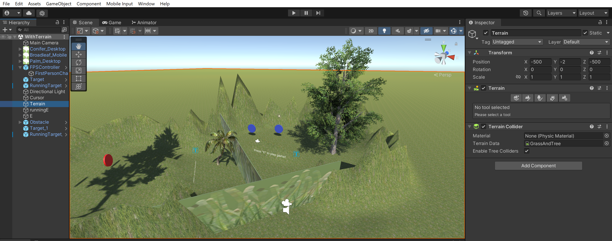

### 天空盒

使用天空盒，按特定按键切换天空盒。

使用`Material[]`数组存放天空盒，需要在Inspector页面手动存放三个天空盒。

- 游戏默认渲染索引为0的天空盒；
- 进入射击运动靶标场景时，渲染索引为1的天空盒；
- 进入射击固定靶标场景时，渲染索引为2的天空盒。

#### 代码

```csharp
using UnityEngine;

public class SkyboxController : MonoBehaviour
{
    public Material[] skyboxes;
    private int currentSkyboxIndex;
	...

    // 其他脚本逻辑...

    void Start()
    {
        currentSkyboxIndex = 0;
		...
        ShowTarget();
    }

    private void ShowTarget()
    {
        RenderSettings.skybox = skyboxes[currentSkyboxIndex];
		...
    }

    private void Update()
    {
        if (Input.GetKeyDown(KeyCode.E))
        {
            // 在按下"E"键时进行射线投射
            Ray ray = new(transform.position, transform.forward);
            RaycastHit hit;

            if (Physics.Raycast(ray, out hit, Mathf.Infinity, interactionLayerMask))
            {
                // 如果射线击中了"E"对象，执行切换天空盒的逻辑
                if (hit.collider.CompareTag("PressErunning"))
                {
                    if (!runningSkybox)
                    {
                        ...
                        currentSkyboxIndex = 1;
                        
                    }
                    else
                    {
                        ...
                        currentSkyboxIndex = 0;
                    }
                    
                }
                else if (hit.collider.CompareTag("PressE")) {
                    if (!staticSkybox)
                    {
                        ...
                        currentSkyboxIndex = 2;

                    }
                    else
                    {
                        ...
                        currentSkyboxIndex = 0;
                    }
                }
                ShowTarget();
            }
        }
    }
}
```

#### 效果

索引0

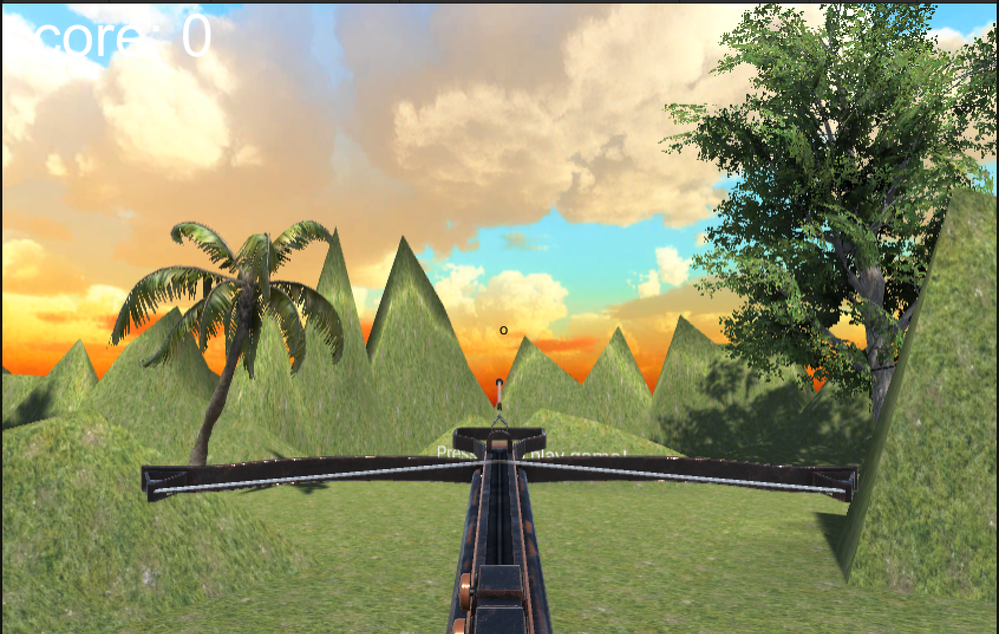

索引1

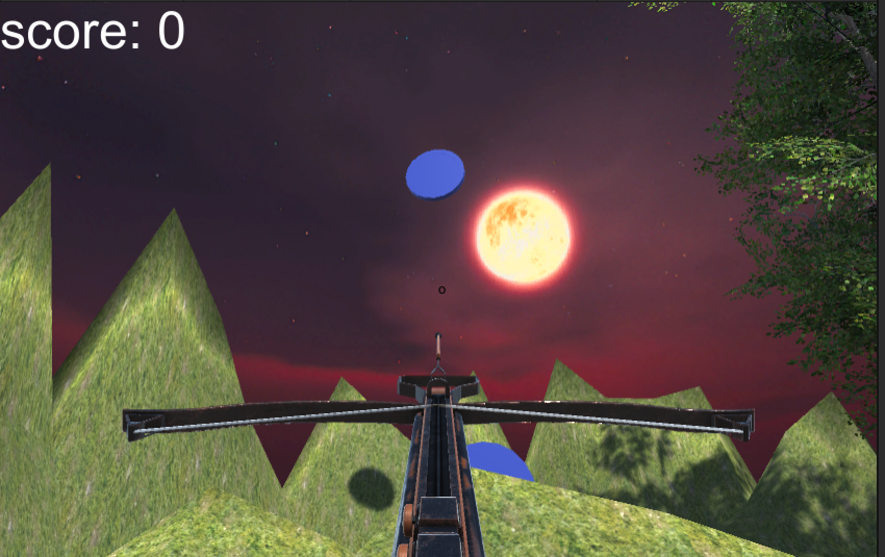

索引2

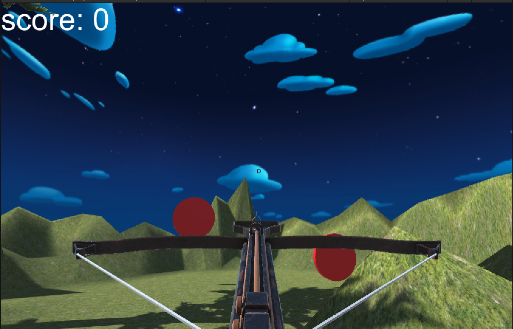

### 固定靶

有一个以上固定的靶标。固定靶标制作成红色的圆柱体预制件。

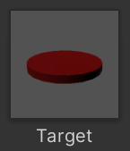

添加了Box Collider用来检测与箭的碰撞，但是检测碰撞的代码挂载到了箭上。

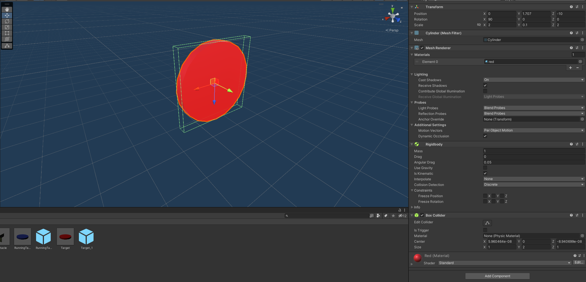

#### 效果


### 运动靶

有一个以上运动靶标，运动轨迹，速度使用动画控制。运动靶标制作成蓝色的圆柱体预制件。

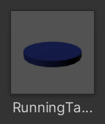

RunningTarget添加了Animator组件，并由RunningTargetController来控制动画，而JumpUp的轨迹就是一个正方形。

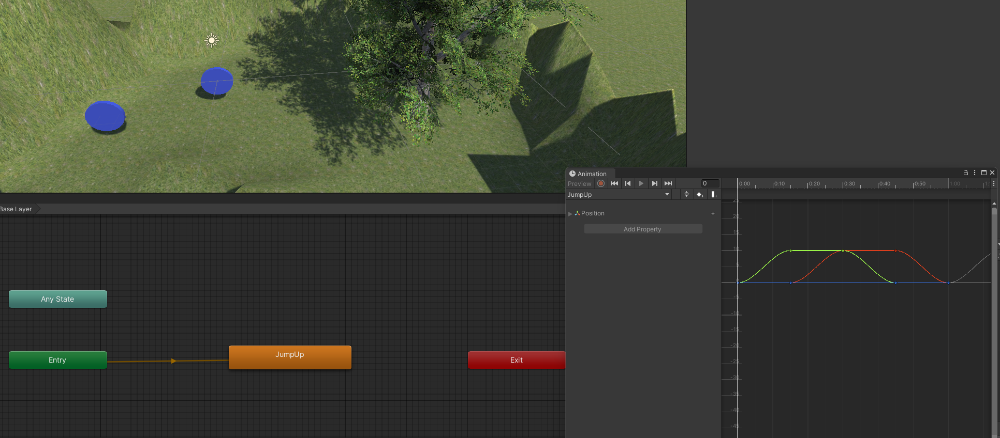

#### 效果


### 射击位

地图上用“Press 'E' to play game!”标记了两个射击位，仅对准标记按下“E”箭后可以拉弓射击，每个位置有无限次机会。这里展示其中一个。

#### 代码

上面的天空盒代码中，有一个是否出现obstacle的`bool`变量`showObstacle`，而是否能够射击的逻辑判断恰好与这个变量相同。

```csharp
using Com.Mygame;
using System;
using Unity.VisualScripting;
using UnityEngine;

public class AnimationController : MonoBehaviour
{
    ...
    // 天空盒控制器
    public SkyboxController skyboxController;

    private void Start()
    {
        // 获取天空盒控制器组件
        skyboxController = Camera.main.GetComponent<SkyboxController>();
        ...
    }

    private void Update()
    {
		...
        // 只有当天空盒中的showObstacle为真时，才可以拉弓。但是拉弓之后，箭在弦上，随时可发
        if (Input.GetMouseButtonDown(0) && empty &&     skyboxController.showObstacle)
        {
            ...         
        }
        ...
    }
}
```

#### 效果

不按“E”进入游戏时无法射击的情况体现不出来，当做是天空盒切换的演示吧。


### 驽弓动画

支持蓄力半拉弓，然后 hold，择机 shoot。

点击左键后开始蓄力拉弓（注意是点击，无需持续按压），然后点击右键hold（无论是否蓄满都需要），最后点击左键发射。箭发射的力度也会随着蓄力程度变化。

预制件CrossBow上添加Animator组件，并做成如下的动画状态机。

Empty -> empty-pull的条件为pull触发器。

empty-pull为empty和fill的混合动画，呈现拉弓的效果。

empty-pull -> hold的条件为hold触发器。

hold动画蓄力程度依赖与hold_power的大小。取值范围[0, 1]

hold -> shoot的条件为shoot触发器。

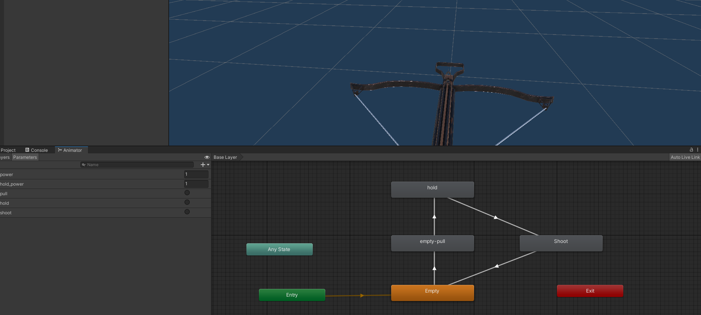

#### 代码

```csharp
using Com.Mygame;
using System;
using Unity.VisualScripting;
using UnityEngine;

public class AnimationController : MonoBehaviour
{
    private Animator animator;
    public bool empty;
    public bool isPulling;
    public bool isHolding;
    public float power = 0f;
    public float hold_power;
    public float powerIncreaseSpeed = 1f;
    public IUserAction action;
    ...

    private void Start()
    {
        // 获取对象上的Animator组件
        animator = GetComponent<Animator>();
        empty = true;
        isPulling = false;
        isHolding = false;
        action = SSDirector.getInstance().currentSceneController as IUserAction;
    }

    private void Update()
    {
        // power随着时间逐渐增大
        if (isPulling)
        {
            power += Time.deltaTime * powerIncreaseSpeed;
            animator.SetFloat("power", power);
        }
        // 处于empty状态时按下左键，触发pull触发器
        if (Input.GetMouseButtonDown(0) && empty &&     skyboxController.showObstacle)
        {
            animator.SetTrigger("pull");
            empty = false;
            isPulling = true;          
        }
        // 处于pulling状态按下右键，触发hold触发器，且power值传递给hold_power，上限为1
        else if (Input.GetMouseButtonDown(1) && isPulling)
        {
            hold_power = Math.Min(power, 1f);
            power = 0f;
            animator.SetFloat("hold_power", hold_power);
            animator.SetTrigger("hold");
            isPulling = false;
            isHolding = true;
        }
        // 处于holding状态按下左键，触发shoot触发器
        else if (Input.GetMouseButtonDown(0) && isHolding)
        {         
            animator.SetTrigger("shoot");
            action.hit(hold_power);
            isHolding = false;
            empty = true;
        }
    }
}
```

#### 效果

##### 蓄满力

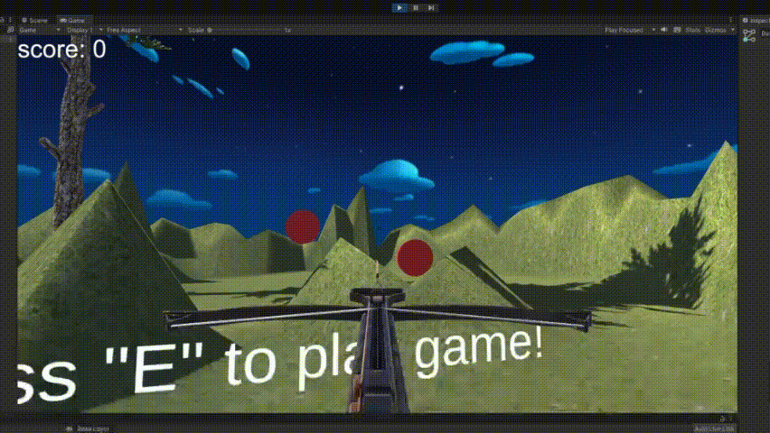

##### 没有蓄满力

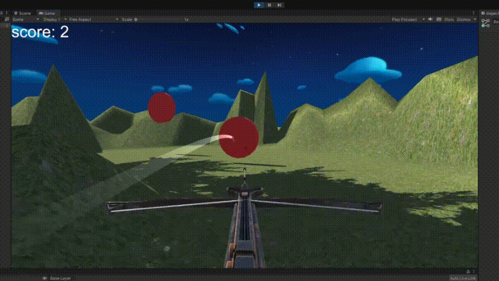

### 游走

玩家的驽弓可在地图上游走，不能碰上树和靶标等障碍。

使用了Standard Assets -> Characters -> FirstPersonCahracter -> Prefabs -> FPSController.prefab。游戏开始时动态加载弩弓（并挂载脚本FollowCamera.cs），由于没有设置弩弓的碰撞器，仅使用了第一人称自带的碰撞器。因此会出现弩弓穿模的现象，不过问题不大。

#### 代码

这里为弩弓跟随摄像机的代码。

```csharp
using System.Collections;
using System.Collections.Generic;
using UnityEngine;

public class FollowCamera : MonoBehaviour
{
    public Transform cameraTransform; // bow's transform
    public Vector3 offset;

    void LateUpdate()
    {
        if (cameraTransform != null)
        {
            // 获取摄像机的旋转
            Quaternion cameraRotation = cameraTransform.rotation;

            // 应用相对旋转到偏移量
            Vector3 rotatedOffset = cameraRotation * offset;

            // 设置弓的位置为摄像机位置加上偏移量
            transform.position = cameraTransform.position + rotatedOffset;

            // 设置弓的旋转为摄像机的旋转
            transform.rotation = cameraRotation;
        }
    }
}
```

#### 效果

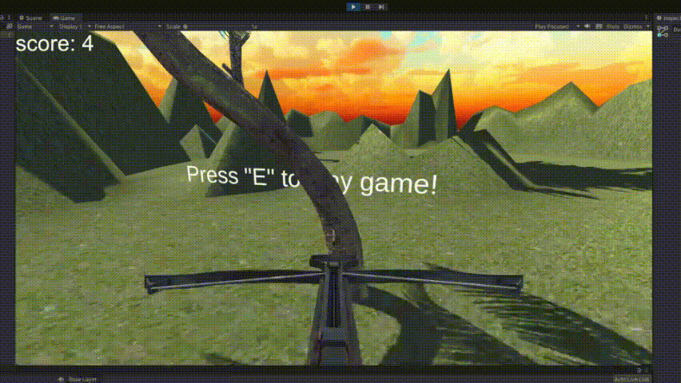

### 碰撞与计分

射中靶标获得一分。

#### 代码

前面提到，碰撞检测的代码挂载到了箭上面，因此，下面为挂载到箭上的代码。

```csharp
using Com.Mygame;
using System.Globalization;
using UnityEngine;
using UnityEngine.TextCore.Text;

public class ArrowCollision : MonoBehaviour
{
    ...
    // FirstController掌管游戏获得的分数score
    public FirstController firstController;

    private void Start()
    {
        firstController = (FirstController)SSDirector.getInstance().currentSceneController;
    }

    private void OnCollisionEnter(Collision collision)
    {
        if (collision.gameObject.CompareTag("TargetRunning") && !hasCollided)
        {
            // 箭与靶碰撞时，分数加1
            firstController.score++;
            ...
        }
        ...
    }
}
```

#### 效果

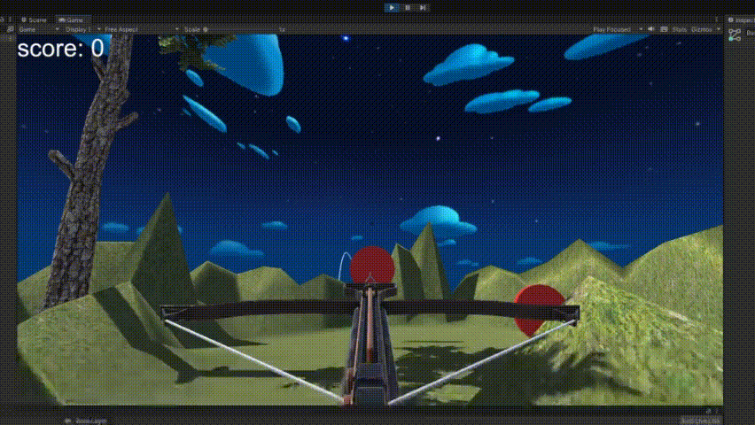

## 参考文献

### 射箭打靶

[【Unity3D】射箭打靶游戏（简单工厂+物理引擎编程）](https://www.cnblogs.com/xieyuanzhen-Feather/p/6666586.html)（主要参考）

[Unity3D学习之射箭小游戏](https://blog.csdn.net/Kiloveyousmile/article/details/69491549)